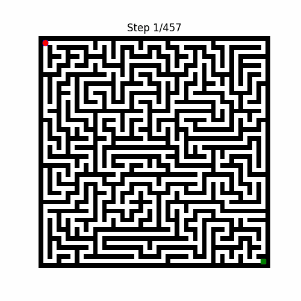

# Micromouse Maze Solver

## Project Overview
The Micromouse Maze Solver is a Python project designed to simulate and solve mazes using algorithms implemented in a virtual mouse. This project is composed of two main Python classes, `Maze` and `Mouse`, and a Jupyter notebook for testing and demonstration purposes.



## Files in the Repository
- `maze.py`: Contains the `Maze` class, which initializes and manages the maze's structure.
- `mouse.py`: Implements the `Mouse` class, designed to navigate through the maze using various algorithms.
- `testingMicromouse.ipynb`: A Jupyter notebook for testing the Micromouse with different mazes and settings.

## Getting Started
### Prerequisites
- Python 3.x
- Matplotlib (for visualization)
- Numpy

### Installation
Clone the repository to your local machine:
```bash
git clone [repository-url]
```
Install the required packages:
```bash
pip install matplotlib numpy
```

### Running the Tests
Open the `testingMicromouse.ipynb` notebook in Jupyter Lab or Jupyter Notebook to run the tests and see the Micromouse in action.

## Usage
### Creating a Maze
```python
from maze import Maze

# Define the maze grid (0 for open paths, 1 for walls)
grid = [[...]]

# Define start and goal positions
start = (x_start, y_start)
goal = (x_goal, y_goal)

# Create a Maze instance
maze = Maze(grid, start, goal)
```

### Navigating the Maze
```python
from mouse import Mouse

mouse = Mouse(maze)
path_found, g_score = mouse.find_path()
```

# Acknowledgements

## Random Maze Generator
This project utilizes the random maze generator from the [python-maze](https://github.com/guofei9987/python-maze) project by [guofei9987](https://github.com/guofei9987). The maze generator adds a dynamic and unpredictable element to the maze-solving experience, making the Micromouse Maze Solver more versatile and challenging. We thank guofei9987 for their contribution to the open-source community and for providing a robust tool that enhances our project.

Citation:
```
guofei9987. 2023. python-maze. GitHub repository. https://github.com/guofei9987/python-maze
```

# Citation

To cite this project or the GitHub profile in your work, please use the following formats:

## APA Style

**Project "A-Star Algorithm for Maze Solving":**
```
Mawio02. (2023). A-Star Algorithm for Maze Solving. Retrieved from https://github.com/Mawio02/A-Star-Algorithm-for-Maze-Solving
```

## BibTeX Style

**Project "A-Star Algorithm for Maze Solving":**
```bibtex
@misc{Mawio02_astar_maze,
  author = {Mawio02},
  title = {A-Star Algorithm for Maze Solving},
  year = {2023},
  howpublished = {\url{https://github.com/Mawio02/A-Star-Algorithm-for-Maze-Solving}}
}
```

## Contributing
Contributions to the Micromouse Maze Solver are welcome. 

## License
This project is licensed under the MIT License - see the `LICENSE.md` file for details.
